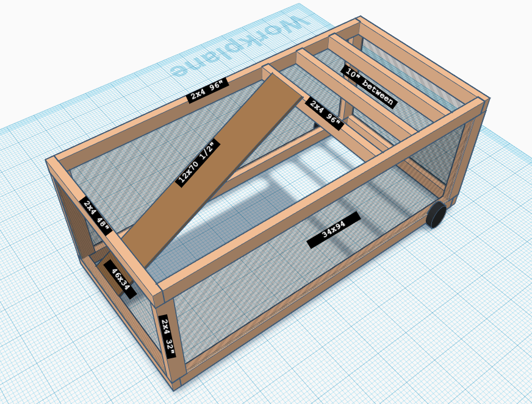
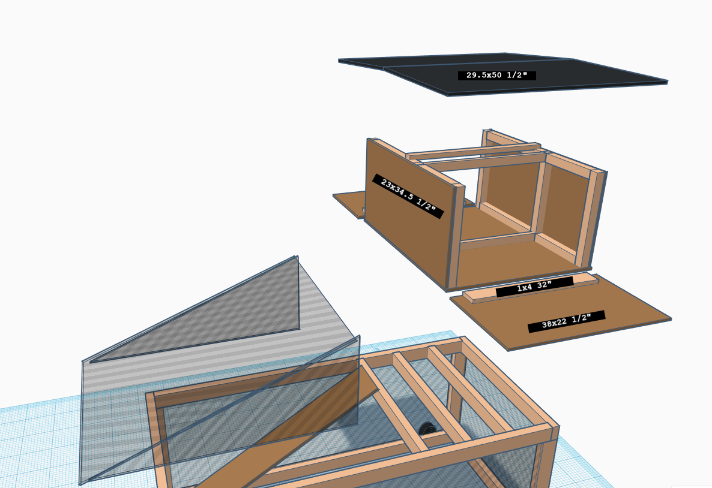
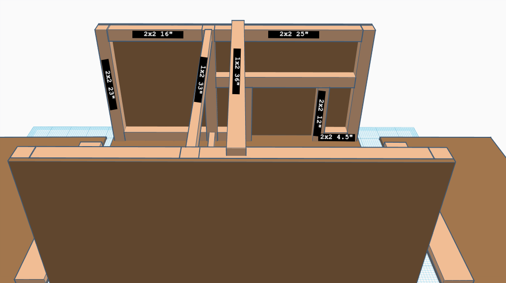
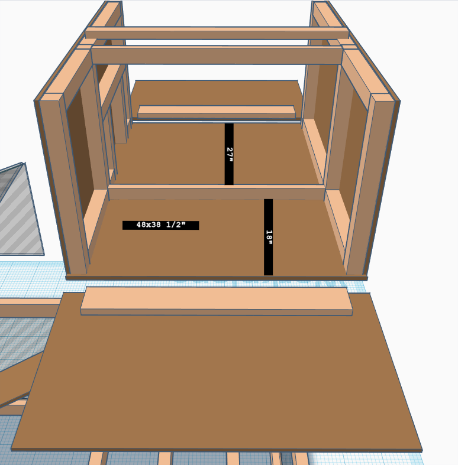

# Chicken Tractor Barn
This is a functional Chicken Tractor allowing for ample room for the chicken to roam, a coop for egg laying and shelter, and storage of food, water, and supplies.

## Tools

* Power Drill
* Skill Saw
* Measuring Tape

## Specifications

* _10_ - **( 8' 2x4 )**
* _2_ - **( 8' 1x2 )**
* _2_ - **( 42" 1x4 )**
* _12_ - **( 8' 2x2 )**
* _7_ - **( 1/2" 4x8 Plywood )**
* _4_ - **( 2x4 Corner Tie )**
* _3_ - **( Face Mount Joist Hanger)**

### Main Structure

|Amt     |   dimensions      |   Notes                       |
|:------:|:-----------------:|:-----------------------------:|
|    4   | 96" 2x4           | Main Structure Long Beams     |
|    4   | 48" 2x4           | Main Structure End Beams      |
|    4   | 32" 2x4           | Main Structure Vertical Beams |
|    3   | 44" 2x4           | Coop/Storage Support Beams    |
|    1   | 1/2" 12x70        | Coop/Storage Plywood Ramp     |
|    2   | 8"                | Wheels                        |

### Coop/Storage

|Amt     |   dimensions      |   Notes                             |
|:------:|:-----------------:|:-----------------------------------:|
|    6   | 23" 2x2           | Coop/Storage Vertical Beams         |
|    2   | 33" 1x2           | Coop/Storage Cross Beams            |
|    1   | 1/2" 48x38        | Coop/Storage Plywood Floor          |
|    2   | 1/2" 23x34.5      | Coop/Storage Plywood Outside Walls  |
|    2   | 1/2" 38x22        | Coop/Storage Plywood Doors          |
|    2   | 32" 1x2           | Coop/Storage Door Beams             |
|    1   | 36" 1x2           | Coop/Storage Roof Beam              |
|    2   | 1/2" 29.5x50      | Coop/Storage Plywood Roof           |
|    4   | 16" 2x2           | Storage horizontal Beams            |
|    4   | 25" 2x2           | Coop horizontal Beams               |
|    2   | 12" 2x2           | Coop Vertical Door Beams            |
|    2   | 4.5" 2x2          | Coop Base Door Beams                |
|    2   | 1/2" 23x33        | Coop/Storage Plywood wall           |
|    2   | 1/2" 23x27        | Coop Plywood wall                   |
|    2   | 1/2" 23x18        | Storage Plywood wall                |

## Diagrams
The following diagrams show the general structure, dimensions, and overall design. Items that are left for your discretion are the placement of the food and water.

### Main Structure

### Main Structure Including Coop/Storage

### Coop/Storage Top View

### Coop/Storage Side View

### Coop/Storage with Walls

